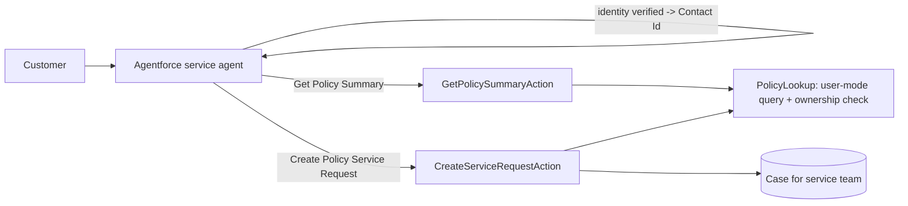

# Agentforce Policy Service Actions (Invocable Apex)

[](https://github.com/Mounika-Mangiri/Agentforce-policy-service-actions/actions/workflows/ci.yml)

Two Apex actions an Agentforce service agent can call: **Get Policy Summary** (read-only status for a verified customer) and **Create Policy Service Request** (opens a Case for a human team). Built so the agent can answer routine policy questions without being able to change a policy or see another customer's data.

> **Representative portfolio project and learning build.** Written independently with synthetic data; no employer or client code. This repo contains the actions, permissions and tests. The agent itself (topic, instructions, channel) is configured in Agent Builder in an org with Agentforce enabled and is **not** stored here. See "Wire it into an agent" below.

## Business problem

Insurance contact centers spend a large share of time on "is my policy active?" and "how do I change my address?". An AI agent can handle these if, and only if, its actions:

- return data only for the customer whose identity was verified,
- never reveal whether someone else's policy number exists,
- hand changes to people instead of writing to the policy,
- explain themselves clearly enough for the planner to pick the right one.

## What this demonstrates

| Area | Where |
| --- | --- |
| `@InvocableMethod` / `@InvocableVariable` written as planner instructions | both action classes |
| Ownership check that returns the same "not found" for missing and foreign policies | `PolicyLookup.ownedBy` |
| User-mode SOQL and DML (`WITH USER_MODE`, `AccessLevel.USER_MODE`) | `PolicyLookup`, `CreateServiceRequestAction.insertCases` |
| Bulkified actions: one query per call, partial-success insert | both actions; `bulkSummaryUsesOneQuery` test |
| Input validation with plain-language messages for the agent to relay | `CreateServiceRequestAction.validate` |
| Least-privilege permission set for the agent user | `Policy_Service_Agent` |



## Run it

```bash
npm install
npm run prettier:check   # the Apex plugin parses every class
sf org create scratch --definition-file config/project-scratch-def.json --alias agent-actions --set-default
sf project deploy start
sf apex run test --code-coverage --result-format human --wait 20
```

## Wire it into an agent (manual, in an Agentforce-enabled org)

1. Deploy this project and assign **Policy Service Agent** to the agent's running user. Check that user can read and edit Case Subject, Description and Origin.
2. In **Agentforce Agents**, open a service agent and add a topic such as *Policy questions*.
3. Topic instructions, for example: "Verify the customer's identity before any policy action. Use Get Policy Summary for status or payment questions. Use Create Policy Service Request for changes; confirm the request type and details first. Never read out full policy numbers of other people."
4. Add both Apex actions to the topic. Map **Verified Contact Id** from the verified-identity step, not from user input.
5. Test in the Agent Builder conversation preview with the synthetic records from the tests.

Record a short screen capture of step 5 and add it to this README before featuring the repo; that is the evidence a hiring manager will look for.

## Tests

CI runs on every push: Prettier (parses every Apex class) and PMD static analysis. The `apex-tests` job deploys to a scratch org and runs the Apex tests below only when a Dev Hub auth URL is saved as the `SFDX_AUTH_URL` repository secret; until then it is skipped.


| Test | Covers |
| --- | --- |
| `summaryForOwnerIsReturned` | trimming/case-insensitive match, fields and message |
| `otherCustomersPolicyLooksNotFound` | foreign and missing policies give identical responses |
| `bulkSummaryUsesOneQuery` | 50 requests, 1 SOQL query |
| `caseIsCreatedForOwner` | Case subject, contact and number |
| `invalidRequestsAreRejectedWithoutDml` | bad type, blank and over-long details, foreign policy; no Case created |

## Limitations and next steps

- Identity verification is assumed to happen earlier in the conversation; this repo does not implement it.
- Add a Prompt Builder template that summarizes the Case for the human team.
- Add Agentforce testing (test center) utterance sets once the agent is configured.

## Credits

Designed and maintained by Mounika M. Code drafted with AI assistance and reviewed by the author. Licensed under MIT.
